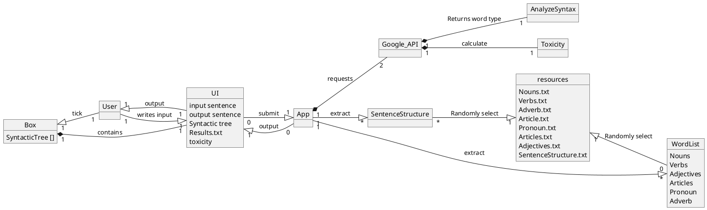
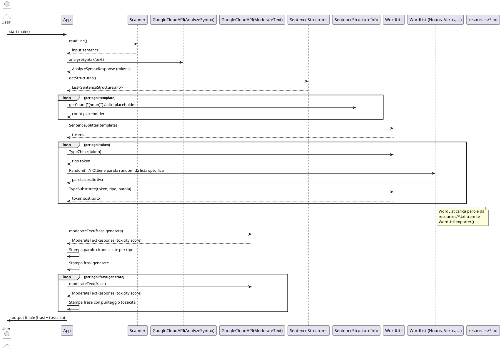
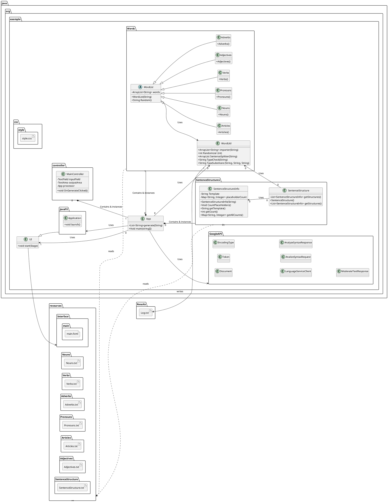
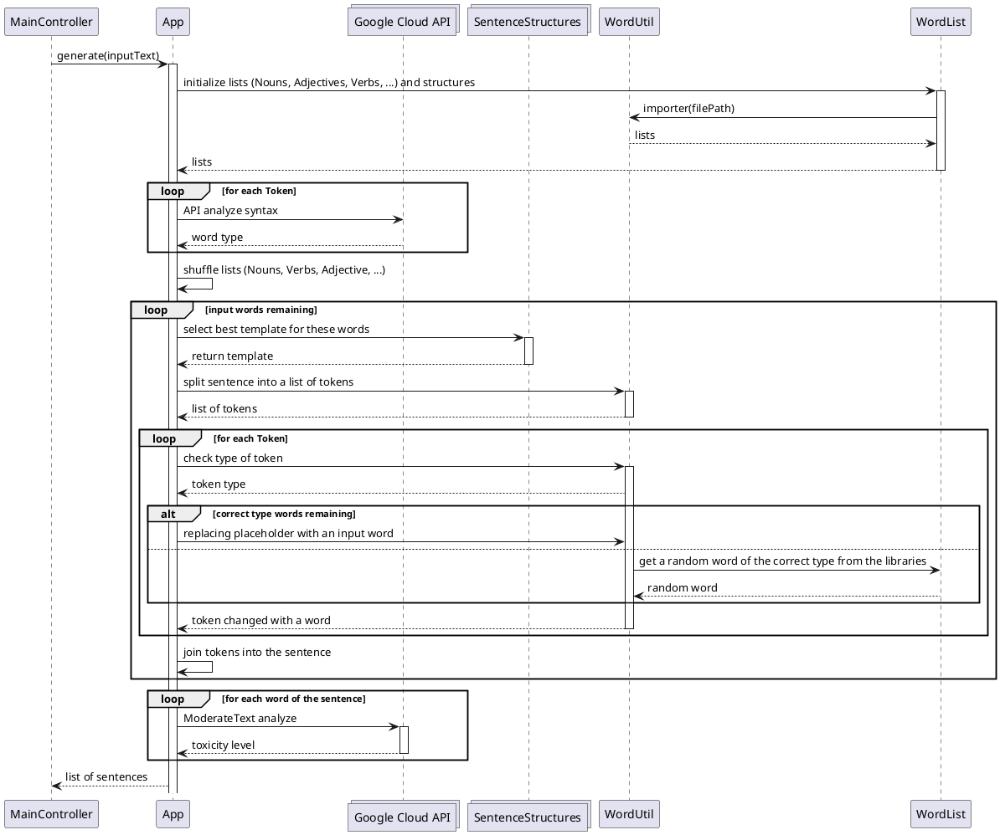

Group Quadri (Garzotto, Pozza, Silvello, Gavrilovska)
# Nonsense Generator
[Domain model](#domain-model)

[System sequence diagrams](#system-sequence-diagrams)

[Design class model](#design-class-model)

[Internal sequence diagrams](#internal-sequence-diagrams)

---
## Domain model

## System sequence diagrams

## Design class model

## Internal sequence diagrams

