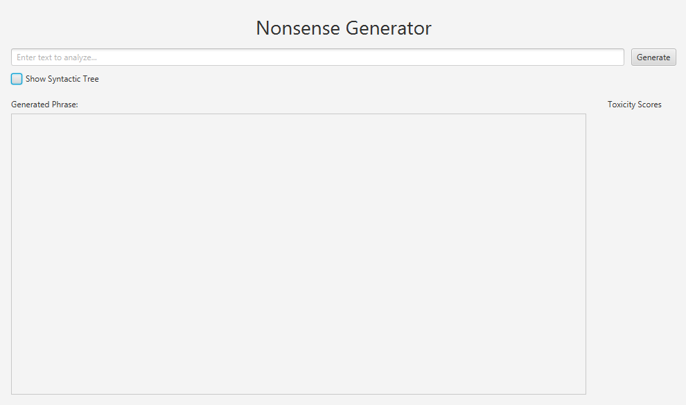

Group Quadri (Garzotto, Pozza, Silvello, Gavrilovska)
# Nonsense Generator


---
# Deliverables
- [Manual](#manual)

- [Design Document](docs/Design_document.md)

- [Acceptance Criteria](docs/Acceptance%20criteria.pdf)

- [System Test Document](docs/SystemTestDocument.pdf)

- [Unit test report](docs/UnitTestReport.pdf)
---

# Manual
# Introduction
The Nonsense Generator is a random sentence generator that allows you to get random sentences using as an imput the words you give with a sentence of your choosing.

- [Main features](#main-features)

- [Installation guide](#how-to-install)

- [Used Technologies](#used-technologies)

- [Main functions taken by libraries](#main-functions-taken-by-libraries)

- [Contributors](#contributors)

# Main features

When opening the program this interface will pop up



On the top of the screen you will be prompted to insert the input sentence in the text field. Then a checkbox under it allows you to show the syntactic tree. 

In the end the program will display the generated sentences together with the respective toxicity level. Then, if the checkbox has been selected, it will show the syntactic tree on the left of the interface.

All the output sentences with their toxicity are automatically saved in `Results/Log.txt` to be accessible even after generating new sentences or closing the program.

The generation of the output procedes in three stages:

### Sentences generation

The generation process procedes in the following way:

- **Lexical extraction**: nouns, verbs, adjectives, adverbs, articles and pronouns are extracted from the imput sentence
- **Sentence Structure selection**: one or more structures are randomly selected from the library as long as there aren't enough words to use all the imput words
- **Sentence structure replacement**: the sentence structure is filled with each word from the input sentence at first, then the remaining spaces are filled with random words taken from the library

### Toxicity analysis

Each sentence generated by the algorithm is passed to Google cloud language's `Moderate Text` that returns a value based on how violent, explicit or vulgar the sentence is. Sentences that have a higher toxicity value are seen as more inapropriate than sentences with a low value.

### Syntactic tree generation

If prompted by checking the checkbox, the program will also show the syntactical tree, a visual representation of the grammatical structure of the sentence by passing the sentence to `Stanford CoreNLP`.

# Design pattern

During the first stage of the development, various possible aproaches were discussed in the group both for the development and the implementation of the desired features.

In the end we opted for an Agile aproach given the short development time that required a fast delivery and short cycles.

## GRASP

### Facade Controller

The class `MainController` is responsible of dealing with system's events. We chose to use the Facade Controller instead of Handlers as we are dealing with minor system's events.

### Low coupling

This project tried to keep a low coupling level as much as possible in each class.

### Pure Fabrication

During the development we decided to handle all the logic within the `App` class.

## GoF

### Factory Pattern (Creational Pattern)

The `App` class is responsible for the creation of all objects (`Sentence Structures`, `Nouns`, `Pronouns`, `Verbs`, `Adjectives`, `Adverbs`, `Articles`)

### Composite Pattern (Structural Pattern)

`Stanford NLP` library, which we implemented in the `MainController` class, handles the gerarchic structure of the syntactic tree.

### Facade Pattern (Structural Pattern)

The class `MainController` is responsible of dealing with system's events. The `App` class implements as a facade `Google Cloud API` using it for syntax and toxicity analysis.

# How to install
- [Maven install guide](#maven)

- [Google API key guide](#google-api-key)

- [Nonsense Generator setup guide](#nonsense-generator-setup)
## Maven
This program requires Maven to run. If you have Maven already installed on your pc, you can skip to the next section.
To check if you have Maven installed from terminal you can use the command `mvn -v`.
If Maven isn't installed you can either download it manually from [Maven's official website](https://maven.apache.org/download.cgi) or from terminal using these commands depending on the system.

- [Windows](#windows-install)

- [Mac](#mac-install)

- [Linux](#linux-install)
### Windows install
You can install Maven from shell using [Chocolatey](https://chocolatey.org/).
If you don't have chocolatey installed, you can install it from administrator PowerShell. First, run the Get-ExecutionPolicy. If it returns Restricted, run one of the two commands `Set-ExecutionPolicy AllSigned` or `Set-ExecutionPolicy Bypass -Scope Process`
Now run the following command in the Windows shell.
```
Set-ExecutionPolicy Bypass -Scope Process -Force; [System.Net.ServicePointManager]::SecurityProtocol = [System.Net.ServicePointManager]::SecurityProtocol -bor 3072; iex ((New-Object System.Net.WebClient).DownloadString('https://chocolatey.org/install.ps1')) 
```
If there are no errors, Chocolatey will be installed. You can verify the installation using the `choco` or `choco -?` command.

Finally you can install Maven using the command `choco install maven -y` from administrator PowerShell.

### Mac install
You can install Maven from the terminal using [Homebrew](https://brew.sh).

You can check if Homebrew is installed by typing `brew --version` in the terminal.

Finally you can download Maven with the following command
```
brew install maven
```
To verify the program installed correctly you can type `mvn -version` in the terminal.

### Linux install
You can Install Maven on Linux by using the command
```
sudo apt install maven
```

To verify the program installed correctly you can type `mvn -version` in the terminal.

## Google Api key
To run this program you will need key to be able to run google's [Analyzing syntax api](https://cloud.google.com/natural-language/docs/analyzing-syntax).

First visit [Google cloud](https://console.cloud.google.com) and log into your account. Then open the drop-down menu on the top left and select `APIs & Services > Enabled APIs and Services`.

In this new page click on `Enable APIs and services` on the top of the page and search for `Cloud Natural Language API` and enable it.

Now that the API has been enabled we need to extract the key. To do so open the drop-down menu on the top left and select `APIs & Services > Credentials`.

On the **Service Accounts** section, select `Manage service accounts` then create a service account using `Create service account` on the top of the screen.

Once created, click on the three dots in the Actions tab then `Manage keys`. Finally create a new key and download it as **JSON**.

## Nonsense generator setup
To run the program it is recomended using [Intellij IDE](https://www.jetbrains.com/idea/) to run it as a Maven project.

Download the [latest release](https://github.com/Leggolta/SoftIng/releases) of the project, extract it to your pc and open it in Intellij.

Next copy the key you extracted earlier in the  `credentials` folder and name it `credentials.json`. In alternative you can just copy the content of the key in the empty `credentials.json` already in the folder.

Now on Intellij check for the Maven icon on the top right of the screen. In the screen that appears click on the spinning arrows then `Reload All Maven Projects` to download the dependencies.

Finally you can run the file using the `run.bat` or `run.command` depending on the system used.

To run the program from linux execute it from terminal using  `./run.sh`.

In alternative you can run the code from all the previously quoted operating systems by opening the terminal from the project's folder and running the command
```
mvn javafx:run
```

In case of errors caused by missing permissions, run this command line before executing the code
**Linux/Mac:**
```
chmod +x run.sh
```

# Used Technologies
|Name|Version|Description|
|---|---|---|
|Java|`21.0.1`|Environment used for the development of the application|
|JavaFX|`20`|Platform based on Java for client application development|
|JUnit|`5.8.2`|Testing framework for Java|
|Maven|`3.9.9`|Build automation and project management tool|
|Google Cloud Language|`2.36.0`|Cloud-based service offering natural language processing capabilities|
|Stanford CoreNLP|`4.5.1`|Natural language processing toolkit developed by Stanford NLP Group|

# Main functions taken by libraries

### Google Cloud Natural Language API

APIs utilized to analyze the syntax of sentences and to validate specific parameters related to sentence properties, such as toxicity. In this project, two Google Cloud Natural Language APIs were used:  

**Analyzing Syntax**: This API returns a set of `Token` objects, which provide essential information for the program's functionality. Among the most frequently used functions there are `getTokenList()`, `analyzeSyntax()` and `getTag()`.

**Moderate Text**: This API returns `ModerateTextResponse` objects, each containing various moderation parameters related to the sentence. The most used function was `moderateText(var document)`.

### Stanford CoreNLP

API that enables to derive linguistic annotations for text, including, parts of speech, dependency and constituency parses, and relations. This api was used in the project to extract and display the syntactic tree. Among the most frequently used functions are `annotate(CoreDocument doc)`, `constituencyParse()`, `isLeaf()` and `children()`.

### JavaFX

Open-source graphical framework for the development of user interface. In the project only the function `launch()` was used in order to run the UI, othen than overwriting the function `start(Stage primaryStage)`.

---

# Contributors
- [Garzotto Mattia](https://github.com/garz8)

- [Pozza Riccardo](https://github.com/Leggolta)

- [Silvello Giacomo](https://github.com/GiacomoSilvello)

- [Gavrilovska Kristina](https://github.com/kiki30072004)
