Group Quadri (Garzotto, Pozza, Silvello, Gavrilovska)
# Nonsense Generator
- [Domain model](#domain-model)

- [System sequence diagram](#system-sequence-diagram)

- [Sequence Diagram](#sequence-diagram)

- [Internal sequence diagrams](#internal-sequence-diagrams)

- [Design class model](#design-class-model)

---
## Domain model
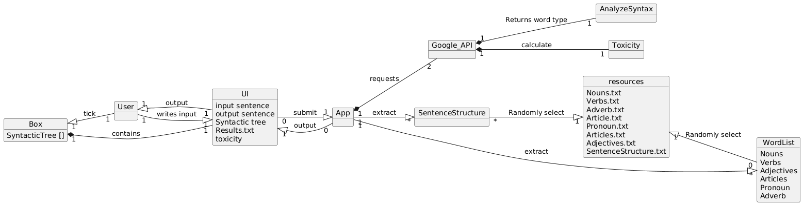

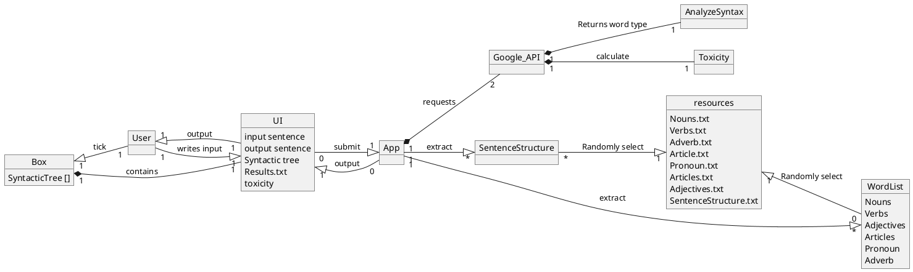

## System sequence diagram
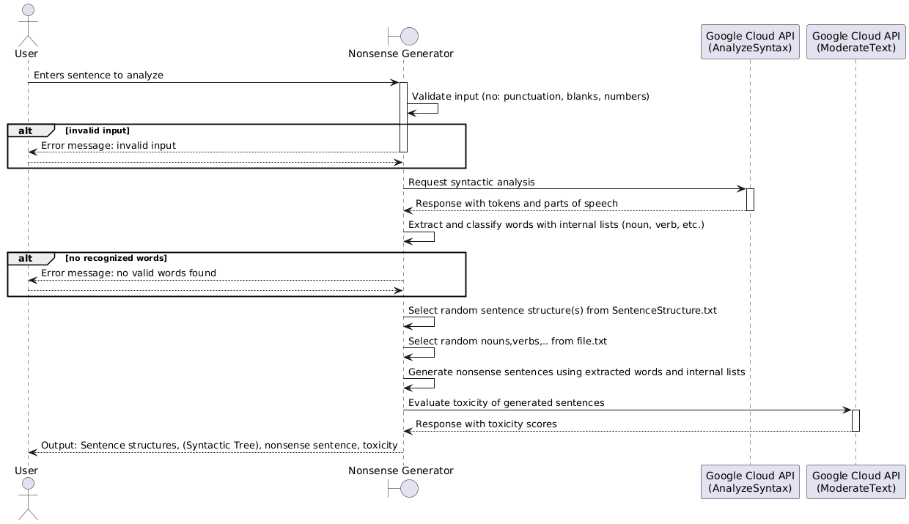

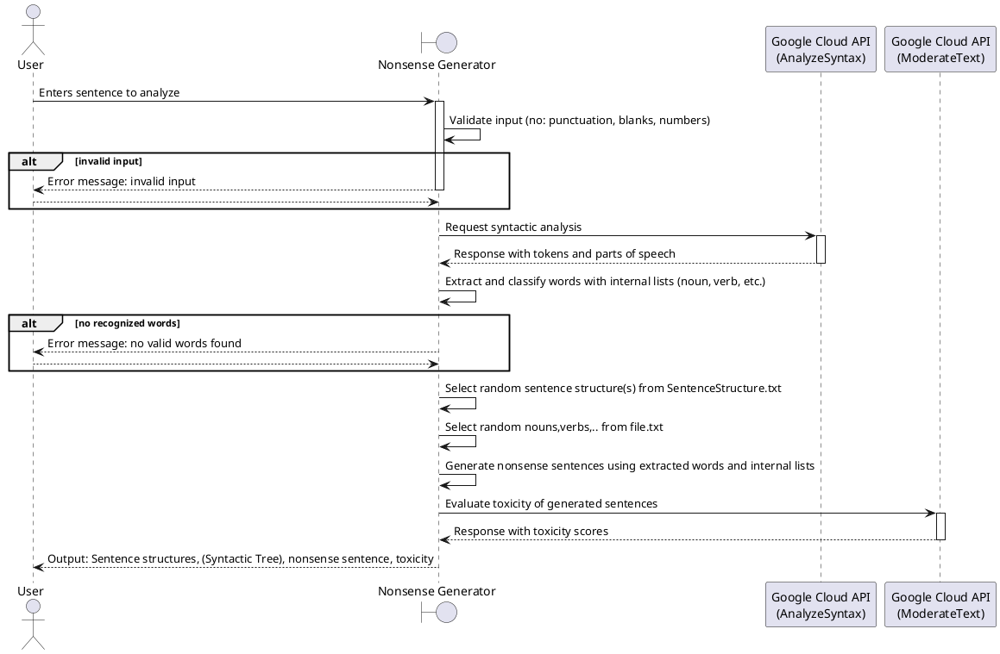

## Sequence Diagram

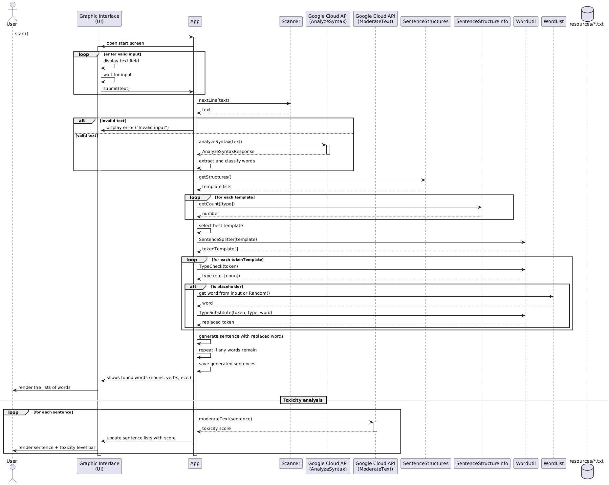

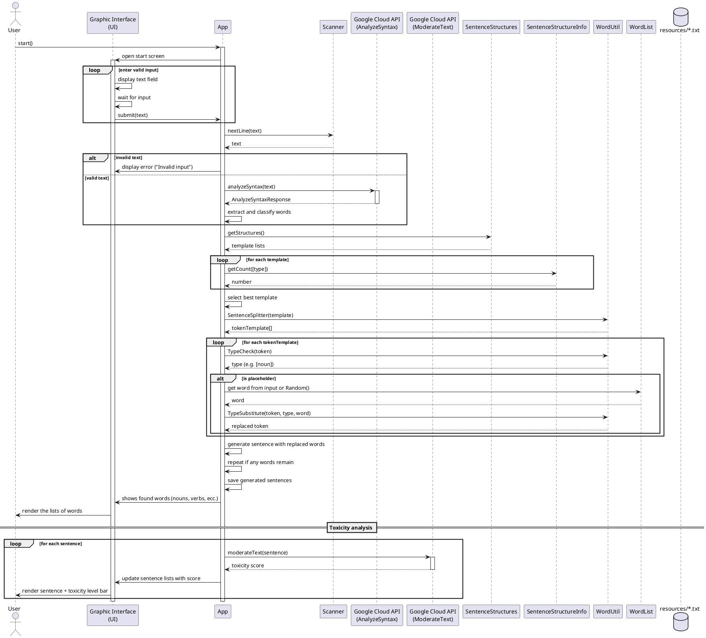

## Internal sequence diagrams

### generate()

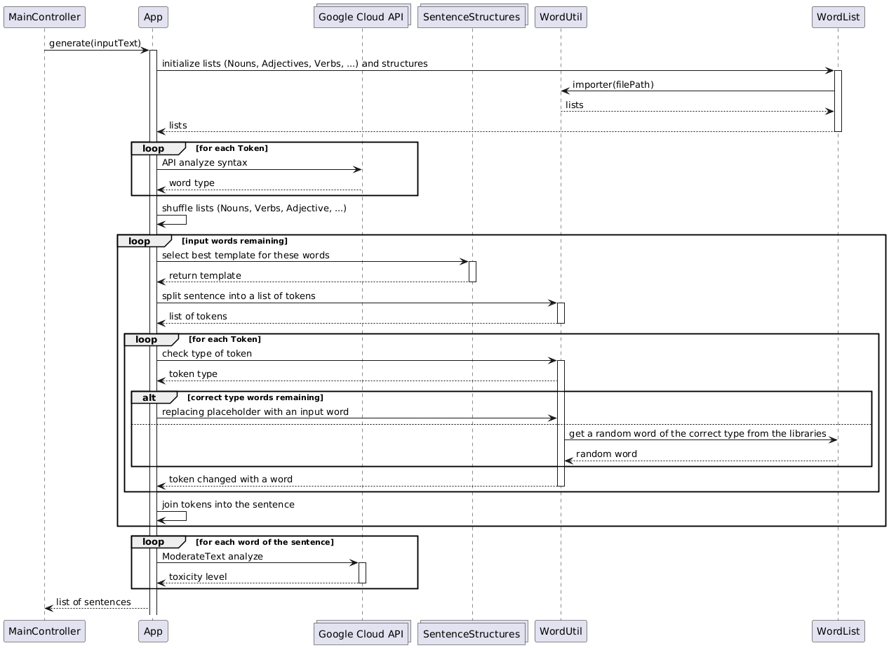
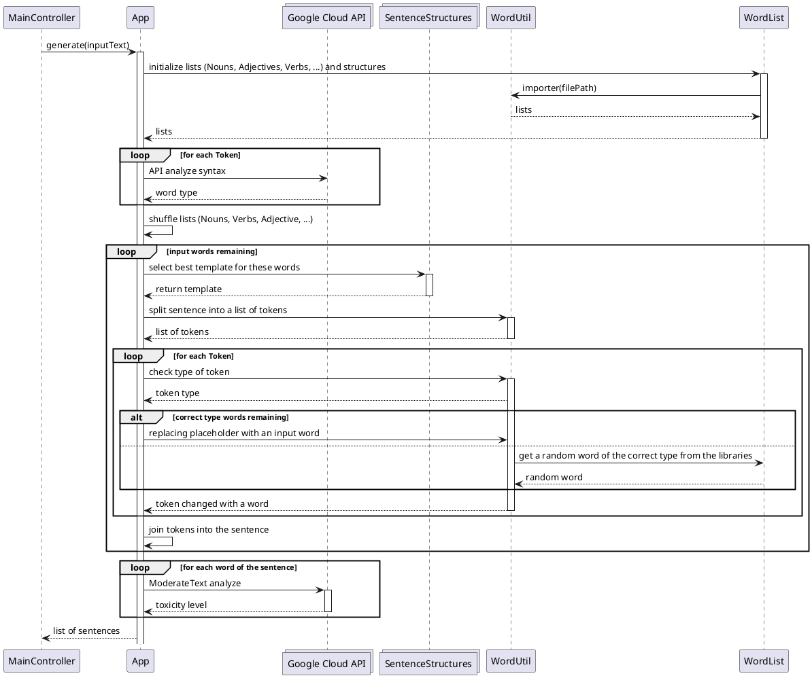

### importer(String)

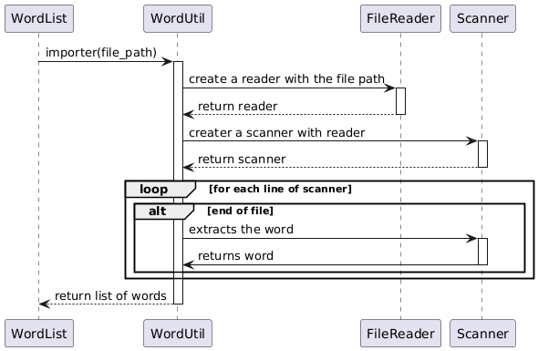
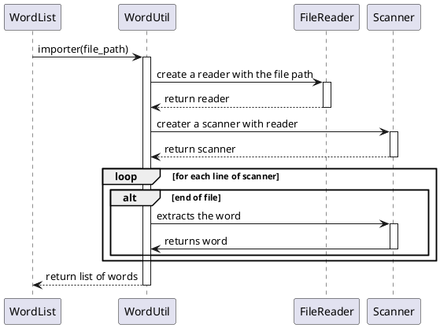

## Design class model
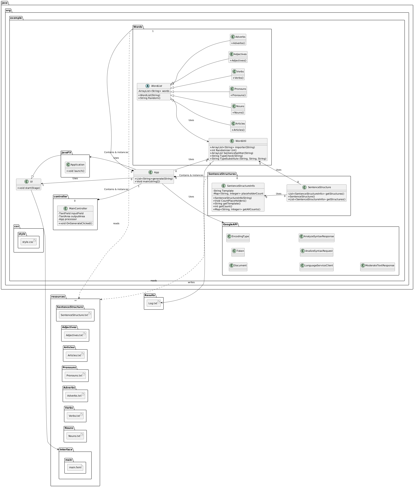

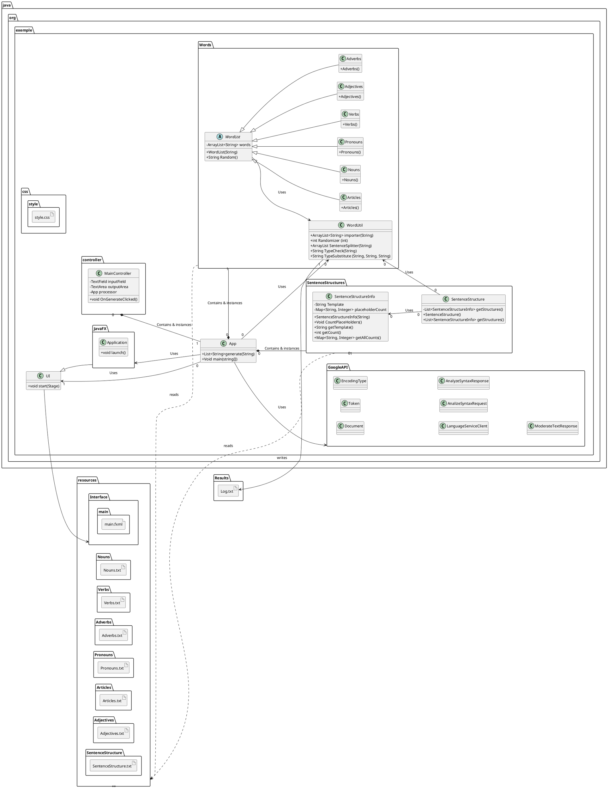
